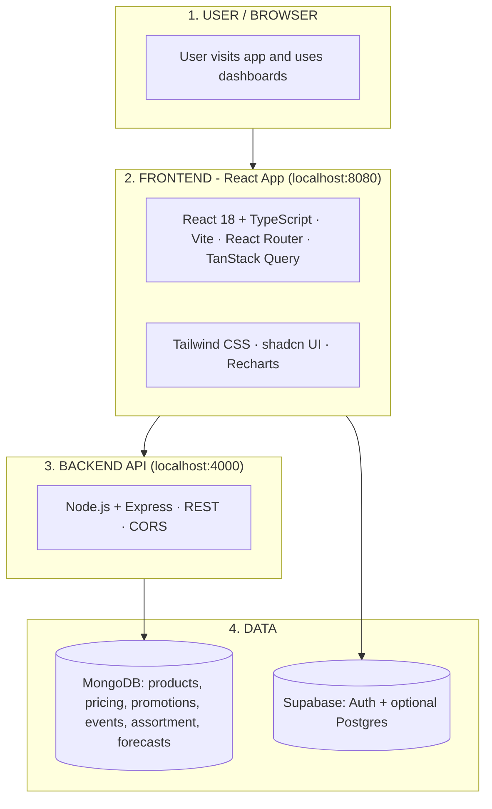

# RGM Tool – Complete Architecture (Clear Overview)

One-page view of the full system and how it fits together.

---

## 1. Complete architecture at a glance

The system has **four layers**. Data flows **down** (user → frontend → backend → data) and **back up** as JSON or session.

```
┌─────────────────────────────────────────────────────────────────┐
│  USER / BROWSER                                                  │
│  User opens the app, logs in, uses dashboards                    │
└────────────────────────────┬────────────────────────────────────┘
                             │
                             ▼
┌─────────────────────────────────────────────────────────────────┐
│  FRONTEND (React app)          │  Port: 8080 (Vite dev)          │
│  • React 18 + TypeScript       │  • Build: Vite                   │
│  • React Router (routes)      │  • UI: Tailwind, shadcn, Recharts│
│  • TanStack Query (API cache)  │  • Auth: Supabase client         │
└────────────────────────────┬────────────────────────────────────┘
                             │
              ┌──────────────┴──────────────┐
              ▼                             ▼
┌─────────────────────────┐   ┌─────────────────────────────────┐
│  BACKEND API            │   │  SUPABASE (cloud)                 │
│  Node.js + Express       │   │  • Auth: login, session, JWT      │
│  Port: 4000             │   │  • Optional: Postgres tables    │
│  • REST endpoints       │   │    for Overview                   │
│  • CORS enabled         │   └─────────────────────────────────┘
└────────────┬────────────┘
             │
             ▼
┌─────────────────────────────────────────────────────────────────┐
│  MONGODB (database)                                              │
│  products | pricing_records | promotions | event_calendar |      │
│  assortment_data | demand_forecasts                              │
└─────────────────────────────────────────────────────────────────┘
```

---

## 2. Clear image diagram

A **single, easy-to-read architecture diagram** is generated as a PNG and should appear in this chat. It shows:

1. **User / Browser** – who uses the app  
2. **Frontend** – React app (tech stack in one box, port 8080)  
3. **Backend API** – Node + Express (port 4000)  
4. **Data** – MongoDB (all collections) + Supabase (Auth + optional DB)  
5. **Arrows** – User → Frontend → API → MongoDB, and Frontend → Supabase  

Save that PNG in your repo as **`docs/rgm-complete-architecture-clear.png`** for a clear, complete architecture image.

---

## 3. What each layer does (plain language)

| Layer | What it is | What it does |
|-------|------------|--------------|
| **User / Browser** | Person on a device | Opens the app URL, logs in, sees Overview, Pricing, Promotions, Assortment, Forecasting. |
| **Frontend** | React app (Vite, TypeScript) | Renders all pages and UI. Calls Supabase for login/session. Calls Node API for products, pricing, promotions, assortment, forecasts. Runs at `http://localhost:8080` in dev. |
| **Backend API** | Node.js + Express server | Exposes REST routes (`/api/products`, `/api/promotions`, etc.). Reads/writes MongoDB. Returns JSON. Runs at `http://localhost:4000`. |
| **MongoDB** | Database | Stores all business data: products, pricing history, promotions, event calendar, assortment, demand forecasts. |
| **Supabase** | Auth + optional DB | Handles login (email/password), session, and protected routes. Optionally stores products/assortment for the Overview page. |

---

## 4. How a request flows (step by step)

1. User goes to `http://localhost:8080` → **Vite** serves the React app.  
2. User logs in → **Frontend** sends credentials to **Supabase Auth** → session is stored.  
3. User opens e.g. Promotions → **Frontend** calls `http://localhost:4000/api/promotions` and `http://localhost:4000/api/promotions/upcoming`.  
4. **Backend API** receives the request → reads **MongoDB** (promotions, event_calendar) → returns JSON.  
5. **Frontend** (TanStack Query) caches the result and renders the Promotions page.  

Same idea for Pricing (products + pricing_records), Assortment (assortment_data + products), and Forecasting (forecasts + products).

---

## 5. Where everything runs

| What | Where | Port / URL |
|------|--------|------------|
| React app (dev) | Your machine (Vite) | `http://localhost:8080` |
| Node API | Your machine | `http://localhost:4000` |
| MongoDB | Your machine or Atlas | `mongodb://127.0.0.1:27017` (from `.env`) |
| Supabase | Supabase cloud | URL and key in `.env` |

---

## 6. One diagram, one doc

- **Diagram:** Use the **PNG** from this chat (or export the Mermaid below) as your single “complete architecture” image.  
- **Doc:** This file (**`COMPLETE_ARCHITECTURE.md`**) is the one-place written overview.  

For a **complete architecture with a clear, easy-to-understand image**, use this doc plus the generated PNG.

---

### Optional: Mermaid for your own PNG/SVG

Paste this at [mermaid.live](https://mermaid.live) to export a clear PNG:


