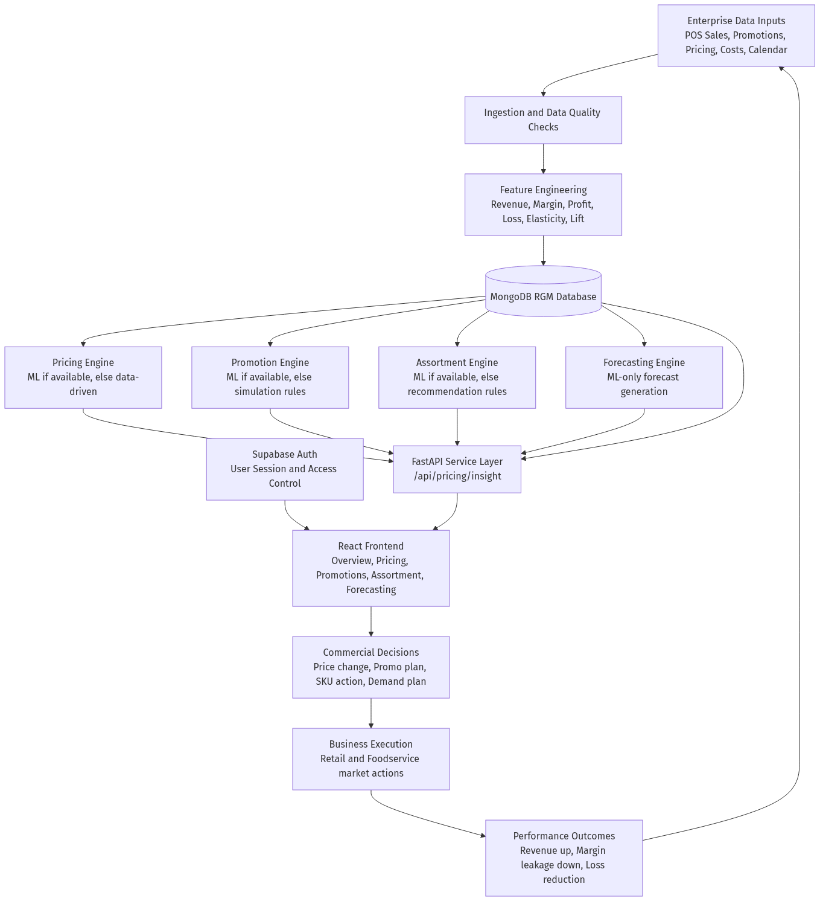

# End-to-End Workflow (RGM Platform)

This workflow shows how your project turns enterprise commercial data into decisions that improve revenue and reduce margin leakage.

## Workflow Diagram (PNG)

## Step-by-Step Flow

1. **Enterprise data comes in**: sales, prices, promotions, product master, costs, and event calendar data.
2. **Data quality and feature engineering**: the backend computes financial and ML-ready features (`revenue`, `gross_profit`, `net_profit`, `loss_amount`, elasticity, lift, etc.).
3. **MongoDB stores all RGM entities**: `products`, `pricing_records`, `promotions`, `event_calendar`, `assortment_data`, `demand_forecasts`.
4. **AI/ML modules run by business domain**:
   - Pricing insight (ML-first with fallback)
   - Promotion recommendation and simulation (ML-first with fallback)
   - Assortment recommendation (ML-first with fallback)
   - Demand forecasting generation (ML-only)
5. **FastAPI exposes APIs** to the frontend for insights, recommendations, simulations, and forecasts.
6. **React app consumes APIs** across Overview, Pricing, Promotions, Assortment, and Forecasting pages.
7. **Business teams execute decisions** in retail/foodservice channels.
8. **Results feed back** as new performance data to continuously improve next cycles.

## Why This Workflow Matters

- Connects all commercial decisions to profit/loss impact.
- Reduces siloed planning across pricing, promo, assortment, and forecasting.
- Enables repeatable, data-driven planning for enterprise use cases (for example PepsiCo-style portfolios).
