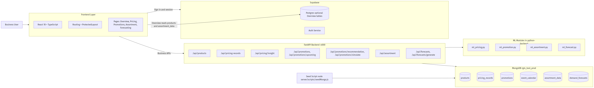

# Project Architecture (Current)

This is the current architecture of your RGM project.

## Architecture Diagram (Image)

## Layer Overview

1. **Frontend Layer**
   - React + TypeScript app (`Vite`)
   - Protected routes and module pages: Overview, Pricing, Promotions, Assortment, Forecasting
2. **Identity and Session**
   - Supabase Auth for login/session management
3. **API Layer**
   - FastAPI backend on port `4000`
   - Exposes domain APIs for pricing, promotions, assortment, and forecasting
4. **ML Layer**
   - `ml_pricing.py`
   - `ml_promotion.py`
   - `ml_assortment.py`
   - `ml_forecast.py`
5. **Data Layer**
   - MongoDB (`rgm_tool_prod`) stores products, pricing, promotions, events, assortment, and forecasts
   - Seeded via `server/scripts/seedMongo.js`

## Main Data Paths

1. User interacts with frontend modules.
2. Frontend calls FastAPI business endpoints.
3. FastAPI reads/writes MongoDB and invokes ML modules.
4. Supabase handles auth/session (and optional overview table reads).
