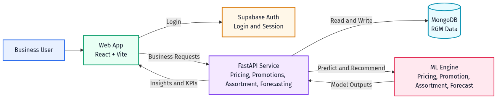
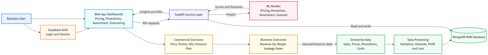

# RGM Platform - Client Presentation Document

**Project:** AI-Driven Revenue Growth Management (RGM)  
**Prepared for:** Client Presentation  
**Date:** February 14, 2026  
**Version:** 2.0

---

## 1. Executive Summary

This project is a unified RGM platform designed for enterprise commercial teams.  
It helps organizations improve pricing quality, promotion effectiveness, assortment decisions, and demand planning using a mix of machine learning and financial analytics.

The platform is built for outcomes:

1. Increase revenue with smarter commercial actions.
2. Reduce margin leakage by tracking loss drivers.
3. Standardize decision-making using consistent data and AI outputs.

---

## 2. Business Problems Solved

| Business problem | Current risk | How this platform solves it |
|---|---|---|
| Pricing decisions are reactive | Revenue or volume is optimized but profit is missed | ML-assisted pricing insight evaluates revenue, profit, and loss together |
| Promotions focus only on lift | High sales lift with weak ROI and cannibalization | Promotion recommendation and simulation estimate ROI, cannibalization, incremental profit, and incremental loss before launch |
| Assortment decisions are subjective | Shelf/menu space allocated to weak SKUs | Assortment engine combines growth, share, profit, and loss to suggest add/keep/delist/review |
| Forecasting is demand-only | Financial planning blind spots | Forecast module converts demand into projected revenue, profit, and loss |
| Teams work in silos | Slow decisions and inconsistent assumptions | One platform aligns pricing, promotion, assortment, and forecasting workflows |

---

## 3. Solution Scope (Modules)

| Module | What users see | Core output |
|---|---|---|
| Executive Overview | KPI cards and revenue by category | Snapshot of pricing, margin, growth, and revenue |
| Pricing | Product pricing table, elasticity and competitor charts, AI insight | Price actions (`increase/decrease/hold`) with projected revenue/profit/loss impact |
| Promotions | Historical performance, upcoming-event references, scenario simulation | Best promo setup by discount/duration/channel with predicted ROI and risk |
| Assortment | SKU/channel performance matrix and recommendation confidence | `add/keep/delist/review` recommendation per SKU-channel row |
| Forecasting | Actual vs predicted demand, trend and seasonality | Future demand plus projected revenue/profit/loss |

---

## 4. AI and Analytics Strategy

| Domain | Engine | Prediction/Recommendation | Fallback behavior |
|---|---|---|---|
| Pricing | `ml_pricing.py` | Units sold at candidate prices, then projected revenue/profit/loss | Falls back to data-driven insight if ML is unavailable |
| Promotions | `ml_promotion.py` | ROI, revenue lift, cannibalization, incremental profit/loss | Falls back to rule-based simulation and historical best pattern |
| Assortment | `ml_assortment.py` | SKU action classification (`add/keep/delist/review`) | Falls back to stored recommendation |
| Forecasting | `ml_forecast.py` | Time-series demand forecast (ML-only mode) | No rule fallback in generation endpoint; returns error if ML is unavailable |

---

## 5. Data Foundation

### 5.1 Data Sources

| Source | Role |
|---|---|
| MongoDB (`rgm_tool_prod`) | Primary store for all RGM data and enriched financial features |
| Supabase Auth | User authentication, session, protected access |
| Supabase tables (`products`, `assortment_data`) | Overview page data source in current frontend |

### 5.2 Core Collections

| Collection | Why it is important |
|---|---|
| `products` | Product context: category, cost, price, competitor, channel, elasticity |
| `pricing_records` | Historical pricing behavior plus profit/loss fields for model learning |
| `promotions` | Campaign design and outcomes for ROI/risk optimization |
| `event_calendar` | Upcoming events connected to historical references |
| `assortment_data` | SKU-channel performance for mix optimization |
| `demand_forecasts` | Historical and projected demand with financial projections |

### 5.3 Demo Data Snapshot

**Snapshot date:** February 14, 2026 (latest seed run)

| Dataset | Rows |
|---|---|
| Products | 8 |
| Pricing records | 18 |
| Promotions | 11 |
| Event calendar | 8 |
| Assortment rows | 11 |
| Demand forecast rows | 19 |

The demo product mix is enterprise-style and includes PepsiCo-aligned examples (cola, sparkling water, chips, sports drinks, fountain syrup) plus adjacent foodservice and snack profiles for channel coverage.

---

## 6. Architecture (Current Implementation)

| Layer | Technology |
|---|---|
| Frontend | React 18, TypeScript, Vite, Tailwind, shadcn, Recharts |
| API | FastAPI (Python) on port `4000` |
| ML | scikit-learn models (`RandomForest`, `Ridge`) |
| Database | MongoDB |
| Identity | Supabase Auth |

### Architecture Diagram

### Workflow Diagram

---

## 7. End-to-End Workflow (Business View)

1. Commercial data is ingested (sales, prices, promotions, cost, event calendar).
2. Data is cleaned and enriched with financial fields (profit/loss aware).
3. ML and analytics engines compute pricing, promotion, assortment, and forecast outputs.
4. API serves outputs to role-based dashboards.
5. Teams execute actions in market (price changes, promo setup, SKU mix updates).
6. Performance feedback becomes new training and decision data.

---

## 8. Security and Governance

| Area | Current implementation |
|---|---|
| Authentication | Supabase email/password authentication |
| Session control | Protected frontend routes via auth context |
| API access | CORS-enabled backend intended for controlled app usage |
| Data traceability | Decisions are backed by stored business records and computed metrics |

---

## 9. KPI Framework for Client Success

| KPI | Why it matters |
|---|---|
| Revenue growth (%) | Topline impact of commercial decisions |
| Net profit growth (%) | True commercial value after costs/losses |
| Margin leakage reduction (%) | Direct measure of loss control |
| Promotion ROI uplift | Measures campaign quality improvement |
| Forecast accuracy (MAPE, RMSE) | Reliability of planning signals |
| Decision cycle time | Operational efficiency improvement |
| Recommendation adoption rate | Business trust and execution maturity |

---

## 10. What Is Ready Today

1. End-to-end UI for all four RGM domains.
2. FastAPI backend with domain endpoints and MongoDB integration.
3. Profit/loss-enriched seeded dataset for realistic demos.
4. ML integration across pricing, promotions, assortment, and forecasting.
5. Client-ready architecture and workflow diagrams.

---

## 11. Deployment and Run Commands (Demo/POC)

From `my-essential-tool-main`:

1. Seed database  
   `npm run seed:mongo`
2. Start backend (FastAPI on port 4000)  
   `npm run server`
3. Start frontend (Vite on port 8080)  
   `npm run dev`

Required environment variables include:

`MONGODB_URI`, `MONGODB_DB`, `PORT`, `VITE_API_BASE_URL`, `VITE_SUPABASE_URL`, `VITE_SUPABASE_PUBLISHABLE_KEY`

---

## 12. Recommended Client Demo Story (10-15 Minutes)

1. Show Executive Overview to frame business value.
2. Show Pricing insight and recommended price action.
3. Run Promotion simulation with two scenarios and compare ROI/profit/loss.
4. Show Assortment recommendations with confidence.
5. Recalculate Forecast for a selected SKU and review projected revenue/profit/loss.
6. Close with KPI framework and rollout roadmap.

---

## 13. Next-Phase Roadmap

| Phase | Focus |
|---|---|
| Phase 1 | Integrate client ERP/POS data pipelines and automate refresh |
| Phase 2 | Add role-based governance, approvals, and audit workflow |
| Phase 3 | Improve model performance with longer history and causal drivers |
| Phase 4 | Production monitoring, alerting, and decision outcome tracking |

---

## 14. Final Value Statement

This project gives commercial teams a practical system to connect actions with financial outcomes.  
Instead of isolated analytics, it provides one operating model where pricing, promotions, assortment, and forecasting are coordinated and measured against revenue, profit, and margin leakage.
