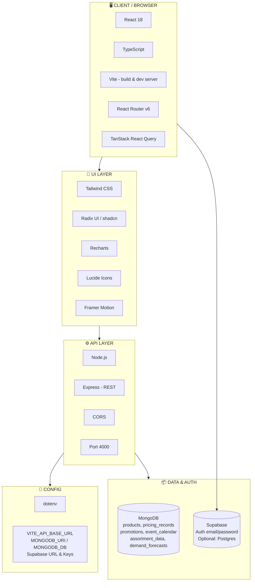

# RGM Tool – Technical Architecture

**What we use for which purpose.**

---

## 1. Overview diagram (Mermaid → export to PNG)

Copy the block below into [mermaid.live](https://mermaid.live) and export as PNG for a technical architecture image.



---

## 2. What we use for which

### Client / Browser

| Technology | What we use it for |
|------------|--------------------|
| **React 18** | UI components, state, and app structure (pages, layout). |
| **TypeScript** | Typing for components, API responses, and fewer runtime errors. |
| **Vite** | Dev server (HMR), production build, and bundling. |
| **React Router v6** | Routes: `/`, `/auth`, `/pricing`, `/promotions`, `/assortment`, `/forecasting`. |
| **TanStack React Query** | Fetching and caching API/Supabase data, loading/error state. |

### UI layer

| Technology | What we use it for |
|------------|--------------------|
| **Tailwind CSS** | Utility-first styling, theme (colors, spacing), responsive layout. |
| **Radix UI / shadcn** | Accessible primitives: buttons, cards, tables, selects, dialogs, etc. |
| **Recharts** | Charts: bar (promotions), line (forecasting), area (seasonality). |
| **Lucide React** | Icons across the app (sidebar, KPIs, buttons). |
| **Framer Motion** | Animations and transitions. |
| **next-themes** | Light/dark theme switching. |
| **react-hook-form + Zod** | Forms and validation (e.g. auth, future forms). |

### API layer (backend)

| Technology | What we use it for |
|------------|--------------------|
| **Node.js** | Runtime for the backend server. |
| **Express** | REST API: routes, JSON body, error handling. |
| **CORS** | Allow browser requests from Vite origin to API on port 4000. |
| **dotenv** | Load `.env` (MONGODB_URI, PORT, etc.) in the server. |

### Data & auth

| Technology | What we use it for |
|------------|--------------------|
| **MongoDB** | Main data store: products, pricing_records, promotions, event_calendar, assortment_data, demand_forecasts. All dashboard data (except optional Overview) comes from here via the Node API. |
| **Supabase** | **Auth**: email/password login, session, protected routes. **Optional**: Postgres tables (e.g. products, assortment) for Overview; can be switched to Node API. |

### Config / environment

| Variable / tool | What we use it for |
|-----------------|--------------------|
| **dotenv** | Load env vars in Node server. |
| **VITE_API_BASE_URL** | Frontend base URL for API (e.g. `http://localhost:4000`). |
| **MONGODB_URI** | MongoDB connection string. |
| **MONGODB_DB** | MongoDB database name (e.g. `rgm_tool_prod`). |
| **PORT** | Express listen port (default 4000). |
| **VITE_SUPABASE_URL**, **VITE_SUPABASE_PUBLISHABLE_KEY** | Frontend Supabase client for Auth (and optional DB). |

### Testing & dev

| Technology | What we use it for |
|------------|--------------------|
| **Vitest** | Unit and component tests. |
| **Testing Library** | React component testing. |
| **ESLint + TypeScript ESLint** | Linting and code quality. |

---

## 3. Request flow (what talks to what)

```
Browser (React)
  → Vite dev server (static + HMR)
  → Supabase JS client: Auth (login, session)
  → Supabase JS client (optional): products, assortment_data for Overview
  → fetch(VITE_API_BASE_URL + /api/...) → Node (Express)
        → MongoDB driver → MongoDB
        → JSON response back to React
```

---

## 4. Where the diagram PNG lives

- **Option A:** Use the **technical architecture PNG** attached in this chat; save it into your repo (e.g. `docs/rgm-technical-architecture.png`).
- **Option B:** Use the **Mermaid diagram** in Section 1 at [mermaid.live](https://mermaid.live) and export your own PNG/SVG.

This document plus the diagram describe the **technical architecture** and **what each technology is used for**.
